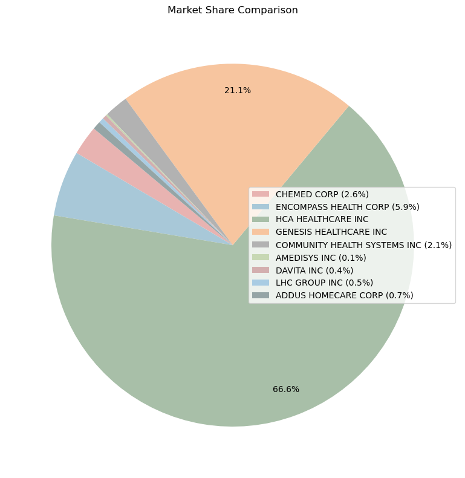

# Health Service Industry Analysis via 10-K Filings (NLP)

NLP-driven competitive analysis of the US health service industry using 5,481 SEC 10-K filings from 358 healthcare firms across 27 years (1994-2020), with HCA Healthcare as the primary case study.

## Method

- Text mining of 10-K filings: TF-IDF vectorization and Word2Vec embeddings
- Cosine similarity on filing text to identify strategic competitors
- Market share and segment growth analysis for the HCA case study

## Key Findings

- Identified HCA's strategic competitors with **99.6% similarity scores** via cosine similarity on filing language
- HCA holds a **66.55% market share** in its segment
- Growth opportunities: **telehealth (24.7% CAGR)** and **outpatient surgery (6.6% CAGR)**

## Repository Contents

| Path | Description |
|---|---|
| `Heath Service Industry Analysis Project Code.ipynb` | Full analysis notebook |
| `report/` | Project report (PDF) |
| `images/` | Key result charts |

## Tech Stack

Python, TF-IDF, Word2Vec (gensim), NLTK, cosine similarity, pandas

---

_Part of my portfolio: [haiiibin.github.io](https://haiiibin.github.io)_
